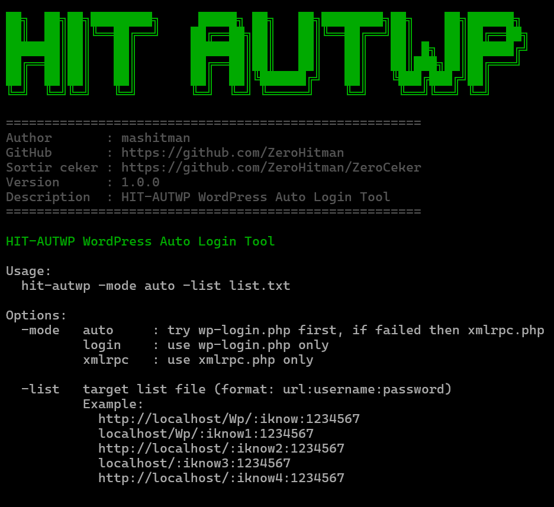

🔥 HIT-AUTWP — WordPress Auto Login Tool
=======================================

⚡ HIT-AUTWP is a precompiled WordPress auto login tool designed for testing
multiple WordPress credentials efficiently.

🔒 Binary only release — source code is private.


--------------------------------------------------
📸 PREVIEW / SCREENSHOTS
--------------------------------------------------




--------------------------------------------------
✨ FEATURES
--------------------------------------------------

🚀 Auto login via wp-login.php and xmlrpc.php  
🔄 Auto mode (wp-login → fallback to xmlrpc)  
🧠 WordPress role detection:
   🔥 administrator
   ✏️ editor
   🧑‍💻 author
   🧩 contributor
   👤 subscriber

📊 Progress bar during execution  
⏸️ CTRL + C pause (resume or stop)  
💾 Save successful results to local file  
🎯 Clean output (no failed login spam)


--------------------------------------------------
🧰 REQUIREMENTS
--------------------------------------------------

✅ Linux / macOS / Windows  
❌ No Go installation required  
❌ No dependencies required for users  

👉 Just download the binary and run.


--------------------------------------------------
🚀 USAGE
--------------------------------------------------

1) Download binary

Using wget:
```
wget https://raw.githubusercontent.com/ZeroHitman/ZeroHitAUTWP/main/hit-autwp
```
Using curl:
```
curl -LO https://raw.githubusercontent.com/ZeroHitman/ZeroHitAUTWP/main/hit-autwp
```

2) Give execute permission (Linux / macOS)
```
chmod +x hit-autwp
```

3) Run the tool

Auto mode (recommended):
```
./hit-autwp -mode auto -list list.txt
```
wp-login only:
```
./hit-autwp -mode login -list list.txt
```
xmlrpc only:
```
./hit-autwp -mode xmlrpc -list list.txt
```

Notes:
- Make sure the binary name matches your system
- For large lists, be patient and avoid interrupting too often
- Use CTRL + C to pause (resume or stop safely)

--------------------------------------------------
⚙️ OPTIONS
--------------------------------------------------
```
-mode   auto     : try wp-login.php first, if failed then xmlrpc.php
        login    : use wp-login.php only
        xmlrpc   : use xmlrpc.php only

-list   target list file (format: url:username:password)
```

--------------------------------------------------
📄 TARGET LIST FORMAT
--------------------------------------------------

Format:
```
url:username:password
```
Examples:
```
http://localhost/Wp/:iknow:1234567
localhost/Wp/:iknow1:1234567
http://localhost/Wp/:iknow2:1234567
localhost/Wp/:iknow3:1234567
http://localhost/Wp/:iknow4:1234567
```
✔ http:// is optional  
✔ Custom WordPress paths supported  
✔ Special characters in passwords supported  


--------------------------------------------------
📤 OUTPUT
--------------------------------------------------

🖥️ Terminal:
- Real-time progress bar
- Colored [SUCCESS] output by role
- No failed login output

📁 Local file (success.txt):
```
http://example.com/wp-login.php|admin|password123|administrator
```

--------------------------------------------------
⏸️ PAUSE / RESUME
--------------------------------------------------

Press CTRL + C during execution:

▶ y : resume process  
⛔ n : stop process safely  

✔ Already saved results will NOT be lost.


--------------------------------------------------
⚠️ SECURITY NOTICE
--------------------------------------------------

🔒 Binary only repository  
🚫 Source code is not included  
🛑 Reverse engineering is discouraged  

This tool is intended for:
✔ Educational purposes  
✔ Authorized testing  
✔ Personal research  

❗ Do NOT use this tool on systems you do not own
or do not have permission to test.


--------------------------------------------------
👤 AUTHOR
--------------------------------------------------

mashitman  
GitHub: https://github.com/ZeroHitman


--------------------------------------------------
⭐ SUPPORT
--------------------------------------------------

If you find this tool useful:
⭐ Star the repository  
📢 Share responsibly  

🔥 Build smart. Test responsibly.
